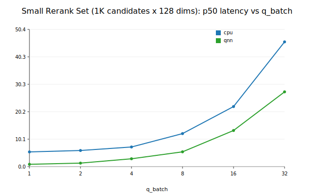
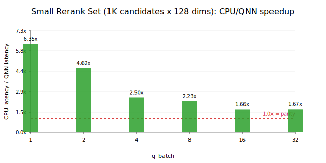
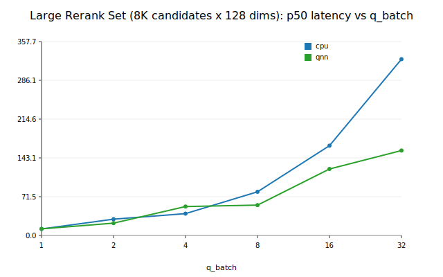
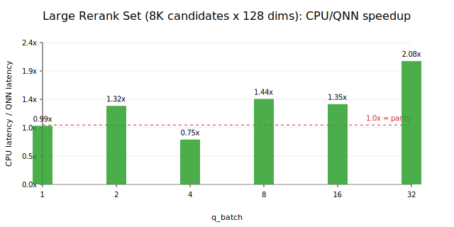
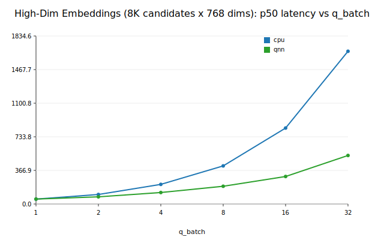
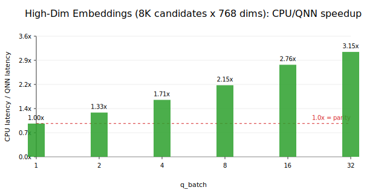

# Benchmark Report

Real Tachyon Particle results for CPU vs QNN using the current direct-QNN path.

## Small Rerank Set (1K candidates x 128 dims)

- Shape: `n=1024`, `d=128`
- Metric: `cosine`
- Backends: `cpu`, `qnn`
- QNN speedup at `q_batch=1`: `6.35x`
- Best observed QNN speedup: `6.35x` at `q_batch=1`

batch | cpu p50 ms | qnn p50 ms | cpu/qnn speedup
---|---:|---:|---:
1 | 5.40 | 0.85 | 6.35x
2 | 5.92 | 1.28 | 4.62x
4 | 7.21 | 2.88 | 2.50x
8 | 12.13 | 5.43 | 2.23x
16 | 22.07 | 13.27 | 1.66x
32 | 45.84 | 27.47 | 1.67x

## Large Rerank Set (8K candidates x 128 dims)

- Shape: `n=8192`, `d=128`
- Metric: `cosine`
- Backends: `cpu`, `qnn`
- QNN speedup at `q_batch=1`: `0.99x`
- Best observed QNN speedup: `2.08x` at `q_batch=32`

batch | cpu p50 ms | qnn p50 ms | cpu/qnn speedup
---|---:|---:|---:
1 | 12.02 | 12.19 | 0.99x
2 | 30.03 | 22.71 | 1.32x
4 | 40.26 | 53.33 | 0.75x
8 | 80.52 | 55.97 | 1.44x
16 | 165.62 | 122.59 | 1.35x
32 | 325.14 | 156.65 | 2.08x

## High-Dim Embeddings (8K candidates x 768 dims)

- Shape: `n=8192`, `d=768`
- Metric: `cosine`
- Backends: `cpu`, `qnn`
- QNN speedup at `q_batch=1`: `1.00x`
- Best observed QNN speedup: `3.15x` at `q_batch=32`

batch | cpu p50 ms | qnn p50 ms | cpu/qnn speedup
---|---:|---:|---:
1 | 53.60 | 53.74 | 1.00x
2 | 103.98 | 78.31 | 1.33x
4 | 214.29 | 125.46 | 1.71x
8 | 416.09 | 193.76 | 2.15x
16 | 829.56 | 300.38 | 2.76x
32 | 1667.81 | 530.01 | 3.15x
